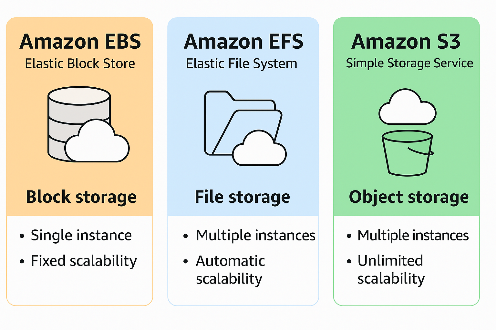

# 1️⃣ Amazon EBS (Elastic Block Store)

**Tipo:** Armazenamento em bloco.

**Uso típico:** Volume de disco para instâncias EC2. Funciona como um disco rígido virtual.

### Características principais

- **Persistência:** Os dados persistem mesmo se a instância EC2 for desligada (dependendo da configuração do volume).
- **Desempenho:** É possível escolher volumes otimizados para I/O alto (IOPS) ou throughput (taxa de transferência).
- **Tipos de volume:**

  - **gp3 / gp2:** SSD de uso geral.
  - **io2 / io1:** SSD de I/O provisionado (para cargas críticas de alto desempenho).
  - **st1 / sc1:** HDD para throughput otimizado e cold storage.

- **Acesso:** Somente por uma instância EC2 por vez (exceto EBS Multi-Attach, disponível apenas para io1/io2 em Linux).
- **Snapshots:** Permite criar backups incrementais (armazenados no S3).

### Quando usar EBS

- Banco de dados (RDS também usa EBS internamente)
- Armazenamento de sistema operacional
- Aplicações que precisam de alta performance de IOPS

 

# 2️⃣ Amazon EFS (Elastic File System)

**Tipo:** Armazenamento de arquivos (file storage).

**Uso típico:** Compartilhamento de arquivos entre múltiplas instâncias EC2.

### Características principais

- **Escalabilidade automática:** Cresce e diminui conforme você adiciona ou remove arquivos.
- **Acesso simultâneo:** Várias instâncias podem montar o mesmo sistema de arquivos ao mesmo tempo.
- Protocolos suportados: NFS (Network File System).
- **Performance:**

  - **Throughput escalável:** Alta taxa de transferência para aplicações com grande volume de arquivos.
  - **Modos de performance:** Bursting e provisioned.

- **Disponibilidade:** Altamente disponível e durável, replicando dados entre AZs (Availability Zones) automaticamente.

### Quando usar EFS

- Aplicações web com múltiplos servidores que precisam de acesso compartilhado
- Armazenamento de logs ou arquivos temporários
- Conteúdo compartilhado em ambientes de contêiner (ECS, EKS)

 

# Comparação

| Recurso               | EBS                                | EFS                                                  |
| --------------------- | ---------------------------------- | ---------------------------------------------------- |
| Tipo de armazenamento | Bloco (block storage)              | Arquivos (file storage)                              |
| Acesso                | 1 instância (exceto Multi-Attach)  | Várias instâncias simultâneas                        |
| Escalabilidade        | Fixa, deve aumentar manualmente    | Automática                                           |
| Protocolos            | N/A (disco bruto)                  | NFS                                                  |
| Ideal para            | Sistema operacional, DB, IOPS alto | Compartilhamento de arquivos, logs, home directories |

 

  

    
     
  

